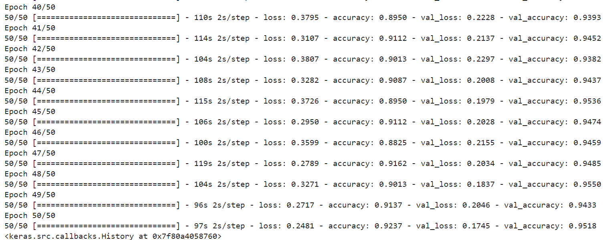

# Machine Learning for Pic2Word
Machine Learning model for image classification on common object pictures

## Our Machine Learning Team:
- M004D4KX1625 - Meisy Nathania Yogianty
- M004D4KX2199 - Elsyafia Yasmin Putri Zamil 
- M180D4KX2497 - Eka Risma Trisya

## Our Dataset
We generate our own dataset, consists of 10k+ pictures of common objects around us.
[Dataset Link](https://drive.google.com/drive/folders/1VxqU7_dBbh4RBfwhP7KY1YbtVzLagerJ?usp=drive_link)

## Image's Classes
Currently, our model could recognize object from 71 class, you can see the class indices on 'class_indices.csv' file

## Model's Detail
We use transfer learning method on pretrained model, ResNet50.
On the last epoch, we get 92% training accuracy and 95% validation accuracy)

